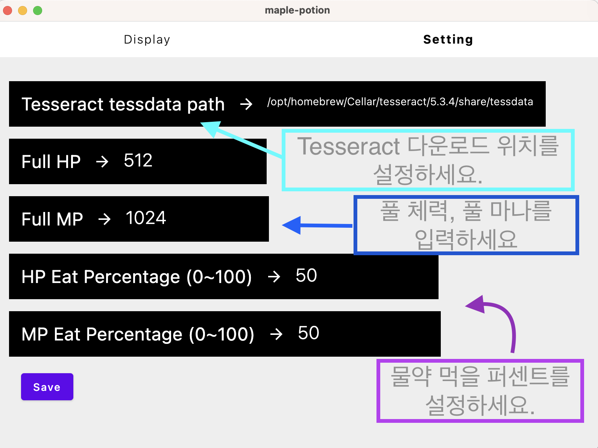

    <h1>Maple potion eater</h1>
    
메이플랜드 자동 포션 이터

    
maple land automatic potion eater

## Preview
* 

## Environment
* [Kotlin Multiplatform](https://kotlinlang.org/docs/multiplatform.html)
* [Jetpack Compose](https://developer.android.com/jetpack/compose)
* Image processing: [Javacv](https://github.com/bytedeco/javacv)
* Digit detection: [Tesseract](https://github.com/tesseract-ocr/tesseract)

## Setup Guide
1. Download and install [Tesseract](https://tesseract-ocr.github.io/tessdoc/Downloads.html)
2. Download and install [AndroidStudio](https://developer.android.com/studio/install)
3. Run AndroidStudio and click Run/Debug Configuration
4. Click plus button and select gradle
5. [Add run script](https://kmp.jetbrains.com/?_gl=1*1dpd701*_ga*OTU0MTk4OTcxLjE3MDgwODQ1NDI.*_ga_9J976DJZ68*MTcwOTg1NDYxOS42LjEuMTcwOTg1NDcyOC41OS4wLjA.&_ga=2.55486248.206602917.1709854620-954198971.1708084542#newProject): #desktopRun -DmainClass=com.jooheon.maple.potion.MainKt --quiet
2. Monitoring on display screen.
    * 
    * 
  