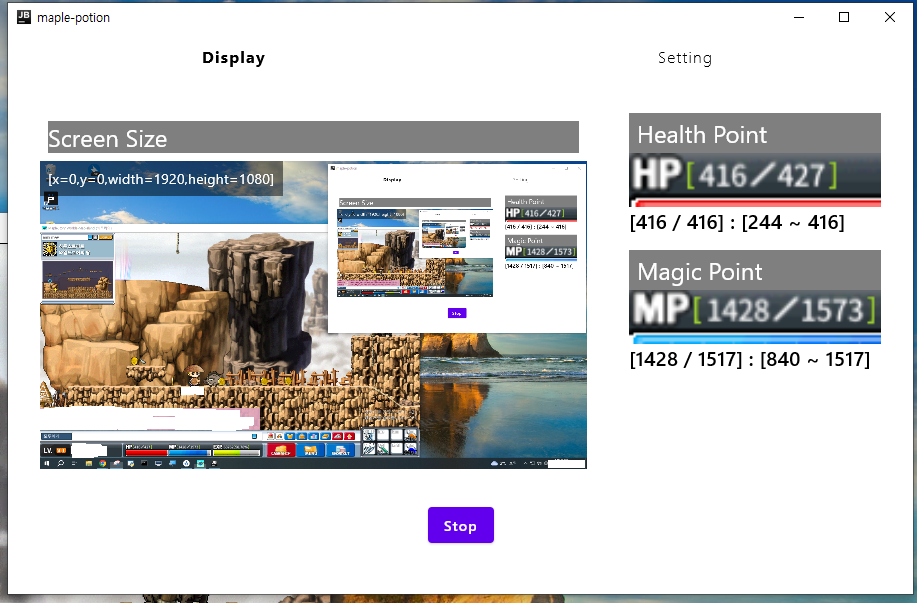
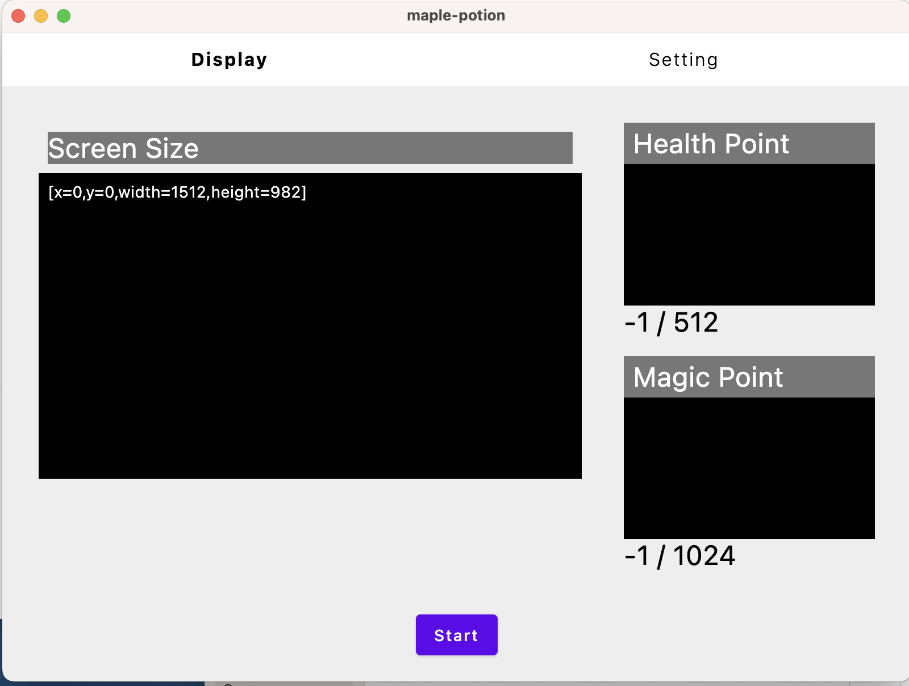

    <h1>Maple potion eater</h1>
    
메이플랜드 자동 포션 이터

    
maple land automatic potion eater

## Preview
  * 

## Environment
  * [Kotlin Multiplatform](https://kotlinlang.org/docs/multiplatform.html) project targeting Desktop.
  * UI: [Jetpack Compose](https://developer.android.com/jetpack/compose)
  * Image processing: [Javacv](https://github.com/bytedeco/javacv)
  * Digit detection: [Tesseract](https://github.com/tesseract-ocr/tesseract)

## Setup Guide
  * Download and install [Tesseract](https://tesseract-ocr.github.io/tessdoc/Downloads.html)
  * 
  * Monitoring on display screen.
  * 
  